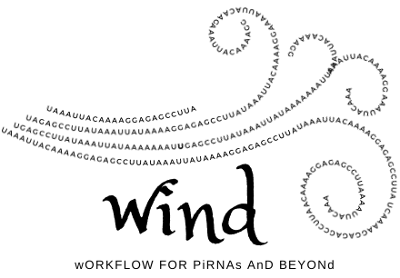
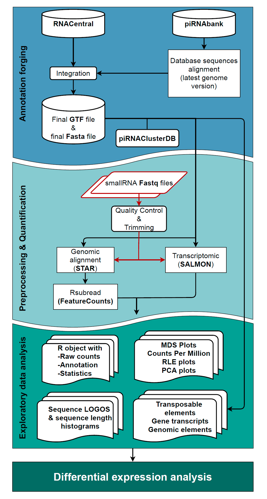

# wind: wORKFLOW FOR PiRNAs AnD BEYONd

We have developed a bioinformatics workflow that could reliably 
characterise sequences from small-RNA sequencing to different databases 
of small non-coding RNAs, and more precisely tackle the crucial issue regarding the piRNA annotation.

The workflow consists of three significant steps:  
1. Annotation forging: the generation of the annotation files for small RNA sequences used in the next quantification step.  
2. Pre-processing & Quantification: pre-processing, alignment and quantification of the reads assigned to sncRNAs (using a dual approach: genomic and transcriptomic analysis).  
3. Exploratory data analysis: result exploration of both quantification methods in parallel and Differential Expression (DE) with two different methodologies (edgeR and limma-voom).

Logo | workflow
--- | ---
 |   
